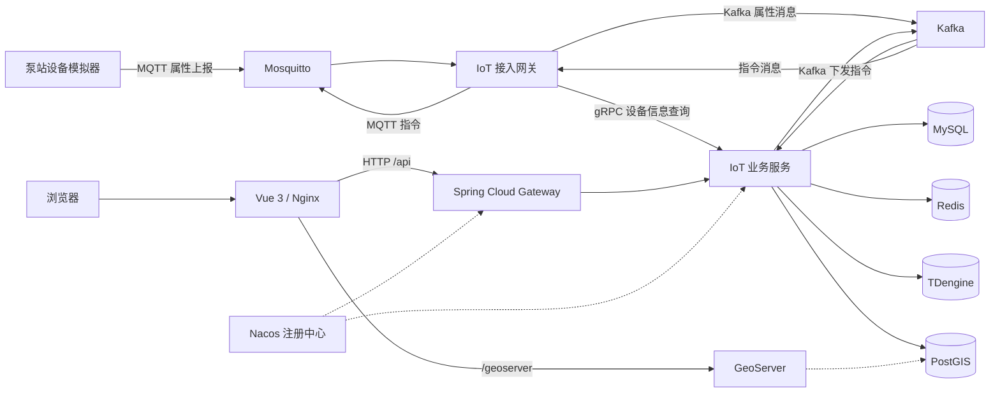

# Pump IoT Platform | 泵站物联网监测平台

> A hands-on, microservice-based IoT platform for simulated pump-station monitoring.  
> 一个面向泵站设备监测场景的物联网学习与工程实践项目，贯穿设备接入、消息处理、数据存储、远程控制与可视化。


**语言 / Languages：** [简体中文](#简体中文) · [English](#english)

---

## 简体中文

### 项目简介

**Pump IoT Platform** 是一个以泵站监测为业务背景的全栈 IoT 实践项目，目标是在本地环境中模拟真实设备的数据采集、消息传输与业务处理过程，而不仅仅展示一个管理界面。

项目使用设备模拟器定期上报电机温度、水位和水泵运行状态，通过 MQTT 接入网关，并结合 Kafka、gRPC 和 Spring Cloud 服务完成设备校验、属性处理与指令下发；同时使用 MySQL 保存业务信息、Redis 保存最新设备状态、TDengine 保存历史时序数据、PostGIS 管理设备空间位置，最终由 Vue 3 页面展示设备、历史曲线、告警和地图信息。

本仓库面向学习、源码研究和本地实验，**尚非生产级产品**。

### 核心功能

- **产品与物模型：** 创建产品、管理物模型版本，定义设备上报属性及其数据类型、范围和必填约束。
- **设备管理：** 创建设备、生成和重置设备密钥、查看设备列表及在线状态。
- **MQTT 数据接入：** 模拟设备周期性发布属性消息，接入网关订阅 Topic，并调用 gRPC 检查设备是否已经注册。
- **异步消息处理：** 借助 Kafka 解耦 MQTT 接入和后端属性处理，支持设备命令及回执的消息链路。
- **多类型数据存储：** MySQL 保存产品、设备、物模型、告警及指令；Redis 缓存最新属性；TDengine 存储属性历史。
- **设备监测与告警：** 根据上报数据更新在线状态，并执行水位阈值等告警判定。
- **远程指令：** 向模拟设备下发采样周期调整指令，记录指令状态并处理设备回执。
- **GIS 可视化：** 使用 PostGIS 保存地理位置及查询附近设备，结合 OpenLayers 和 GeoServer 相关组件进行地图展示。
- **管理前端：** 提供设备列表、设备详情、历史趋势和设备地图等页面。

> 上述内容依据当前源码中的模块与功能入口整理。部分能力仍需要数据库初始化、设备注册及运行环境配置后才能完整演示。

### 技术栈

| 层次     | 主要技术                                                     |
| -------- | ------------------------------------------------------------ |
| 前端     | Vue 3、TypeScript、Vite、Element Plus、ECharts、OpenLayers   |
| 后端     | Java 21、Spring Boot 4、Spring Cloud、Spring Cloud Gateway、MyBatis-Plus |
| 设备接入 | MQTT、Eclipse Mosquitto、Eclipse Paho                        |
| 服务通信 | Kafka、gRPC、Protocol Buffers、Nacos                         |
| 数据层   | MySQL、Redis、TDengine、PostgreSQL / PostGIS                 |
| GIS 服务 | GeoServer                                                    |
| 部署     | Docker、Docker Compose、Nginx、Maven                         |

### 系统架构



图中 Nacos 提供服务发现与配置管理，**不直接转发 HTTP 请求**；HTTP 请求由 Nginx、Spring Cloud Gateway 和目标业务服务按各自职责处理。GeoServer 图层需根据实际数据源单独配置。

### 仓库结构

```text
pump-iot-platform/
├── sxupr-api-gateway/          # Spring Cloud HTTP API 网关
├── sxupr-module-iot-api/       # gRPC / Protobuf 接口定义
├── sxupr-module-iot-core/      # 公共枚举、消息模型、Topic 定义
├── sxupr-module-iot-gateway/   # MQTT 接入、gRPC 校验、Kafka 收发
├── sxupr-module-iot-server/    # IoT 业务 API、服务和数据访问
├── sxupr-device-simulator/    # 泵站设备模拟器
├── sxupr-ui-admin-vue3/       # Vue 3 管理前端
├── deploy/                     # Docker Compose、Nginx、Mosquitto 配置
├── sql/                        # MySQL 与 PostGIS 建表脚本
└── pom.xml                     # Maven 聚合工程
```

### 本地运行

**环境要求：** JDK 21、Maven、Docker 与 Docker Compose。若要单独开发前端，还需要 Node.js 和 npm。项目在本地开发场景下设计，建议先使用隔离的开发环境。

**1. 克隆并打包 Java 模块**

```bash
 git clone https://github.com/zeror-infinityr/pump-iot-platform.git
 cd pump-iot-platform
 mvn clean package -DskipTests
```

**2. 启动基础依赖**

```bash
 docker compose -f deploy/docker-compose.yml up -d mysql redis mosquitto kafka tdengine postgis geoserver nacos
```

**3. 初始化数据库**

MySQL 的建表脚本位于 `sql/`，按序执行 `01_create_iot_product.sql`、`02_thing_model_property_and_version`（该文件当前没有 `.sql` 后缀）、`03_IOT_DEVICE.sql`、`04_AlterTable.sql` 和 `05_IOT_Device_Command.sql`。例如在项目根目录执行：

```bash
 docker exec -i pump-iot-mysql mysql -upump_iot -ppump_iot_dev pump_iot < sql/01_create_iot_product.sql
```

其余 MySQL 脚本可按相同方式导入。PostGIS 的建表 SQL 位于 `sql/06_PostGIS.sql`，其中包含一条 `device_id=1` 的演示位置数据，导入前请确认它与你实际注册的设备一致，或移除示例 `INSERT`。

**注意：** 当前仓库没有提供完整的 TDengine 初始化 SQL。历史属性功能需要提前建立 `pump_iot_ts` 数据库及 `device_property_history` 超级表，并保证字段与 `DevicePropertyHistoryStore` 中的写入语句对应。这是项目尚待补齐的部署环节，不能仅靠 `docker compose up` 保证完整业务链路可用。

**4. 构建并启动应用容器**

```bash
 docker compose -f deploy/docker-compose.yml up -d --build
 docker compose -f deploy/docker-compose.yml ps
```

**5. 访问项目**

| 服务             | 默认本地地址                         |
| ---------------- | ------------------------------------ |
| Web 管理端       | http://localhost:18000               |
| API 网关         | http://localhost:18081               |
| 业务服务测试接口 | http://localhost:18081/api/iot/hello |
| Nacos 控制台     | http://localhost:18048               |
| 本机 MQTT Broker | `localhost:11883`                    |

```bash
curl http://localhost:18081/api/iot/hello
```

如需查看应用日志：

```bash
docker compose -f deploy/docker-compose.yml logs --tail=100 iot-server iot-gateway device-simulator
```

> **设备模拟器提示：** `sxupr-device-simulator/src/main/resources/application.yml` 中配置了示例 `product-key` 和设备名 `pump-001`。实际测试前，需要创建产品、为产品创建物模型版本，再创建同名设备，并将模拟器配置里的 `product-key` 改为实际生成的值；否则网关会拒绝未注册的设备消息。

### 部分 API 示例

| 方法   | 路径                                                  | 用途             |
| ------ | ----------------------------------------------------- | ---------------- |
| `GET`  | `/api/iot/hello`                                      | 服务连通性检查   |
| `POST` | `/api/iot/products`                                   | 创建产品         |
| `GET`  | `/api/iot/products`                                   | 产品列表         |
| `POST` | `/api/iot/products/{productId}/thing-model/versions`  | 创建物模型版本   |
| `POST` | `/api/iot/devices`                                    | 注册设备         |
| `GET`  | `/api/iot/devices/{id}/latest-properties`             | 最新设备属性     |
| `GET`  | `/api/iot/devices/{id}/history?identifier=waterLevel` | 属性历史         |
| `POST` | `/api/iot/devices/{id}/commands/sampling-interval`    | 调整设备采样周期 |
| `GET`  | `/api/iot/devices/{id}/alarms`                        | 查询告警         |
| `GET`  | `/api/iot/gis/devices/nearby`                         | 查询附近设备     |

### 当前状态与说明

- 项目为个人学习和工程实践用途，接口、数据库结构和部署配置仍可能调整。
- Compose 中包含本地开发用的示例密码，并且 Mosquitto 当前允许匿名连接，**切勿将这些默认配置直接用于公网或生产环境**。
- TDengine 初始化、初始化数据自动化和更完整的部署说明仍需完善；启动容器不代表全部业务功能已完成验收。
- 当前仓库未提供根目录 `LICENSE` 文件；代码的使用与再分发权限以之后明确发布的许可证为准。

---

## English

### Overview

**Pump IoT Platform** is a full-stack, microservice-based learning project built around a simulated pump-station monitoring scenario. It explores the end-to-end journey of IoT data, from device telemetry and MQTT ingestion to asynchronous processing, persistence, remote commands, and visualization.

A simulated device periodically publishes motor temperature, water level, and pump operating status. The ingestion gateway consumes MQTT messages, checks registered devices via gRPC, and forwards messages through Kafka. The business service processes telemetry and uses MySQL for domain data, Redis for the latest state, TDengine for time-series history, and PostGIS for geospatial data. A Vue 3 frontend exposes device monitoring views, charts, alarms, and a map.

This is an **educational and experimental project, not a production-ready platform**.

### Features

- Product management and versioned thing models with property definitions and validation.
- Device registration, credential generation/reset, and online status tracking.
- MQTT telemetry ingestion with gRPC-based device lookup and Kafka messaging.
- Recent device state in Redis and historical property records in TDengine.
- Threshold-based alarms, including water-level monitoring.
- Remote sampling-interval commands with device acknowledgments.
- Device location storage and nearby-device searches using PostGIS.
- Vue 3 pages for device lists, details, trends, and map-based exploration.

Some workflows depend on manual database bootstrap and matching simulator/device configuration.

### Tech stack

| Area              | Technologies                                                 |
| ----------------- | ------------------------------------------------------------ |
| Frontend          | Vue 3, TypeScript, Vite, Element Plus, ECharts, OpenLayers   |
| Backend           | Java 21, Spring Boot 4, Spring Cloud, Spring Cloud Gateway, MyBatis-Plus |
| Ingestion         | MQTT, Eclipse Mosquitto, Eclipse Paho                        |
| Messaging and RPC | Kafka, gRPC, Protocol Buffers, Nacos                         |
| Data storage      | MySQL, Redis, TDengine, PostgreSQL / PostGIS                 |
| GIS               | GeoServer                                                    |
| Deployment        | Maven, Docker, Docker Compose, Nginx                         |

### Architecture and modules

The architecture diagram in the Chinese section illustrates the two main paths: **HTTP requests** travel from the browser through Nginx and Spring Cloud Gateway to the IoT business service, while **device telemetry** travels through Mosquitto, the IoT ingestion gateway, Kafka, and the business service. gRPC is used for an internal device lookup; Nacos supports discovery/configuration rather than directly proxying HTTP requests.

The repository contains six Maven modules: `sxupr-api-gateway`, `sxupr-module-iot-api`, `sxupr-module-iot-core`, `sxupr-module-iot-gateway`, `sxupr-module-iot-server`, and `sxupr-device-simulator`. The frontend is in `sxupr-ui-admin-vue3`; infrastructure configurations and database scripts live under `deploy/` and `sql/`.

### Getting started

**Prerequisites:** JDK 21, Maven, Docker and Docker Compose. Node.js and npm are additionally required for standalone frontend development.

**1. Clone and build**

```bash
git clone https://github.com/zeror-infinityr/pump-iot-platform.git
cd pump-iot-platform
mvn clean package -DskipTests
```

**2. Start infrastructure services**

```bash
docker compose -f deploy/docker-compose.yml up -d mysql redis mosquitto kafka tdengine postgis geoserver nacos
```

**3. Bootstrap databases**

Apply the MySQL scripts under `sql/` in numerical order. Note that `02_thing_model_property_and_version` currently has no `.sql` extension. Apply `sql/06_PostGIS.sql` to PostGIS after reviewing its example row for `device_id=1`.

The TDengine database `pump_iot_ts` and its `device_property_history` supertable must also be created with a schema compatible with `DevicePropertyHistoryStore`; a complete initialization script is **not yet included** in this repository.

**4. Start the applications**

```bash
docker compose -f deploy/docker-compose.yml up -d --build
docker compose -f deploy/docker-compose.yml ps
```

Open the UI at **http://localhost:18000** and check the API at **http://localhost:18081/api/iot/hello**. Nacos is exposed locally at **http://localhost:18048**.

**5. Register a simulated device**

Create a product, create its thing-model version, and then register a device named `pump-001`. Update the simulator's `product-key` in `sxupr-device-simulator/src/main/resources/application.yml` to match the generated product key before validating the MQTT flow.

### Development notes

This repository is evolving. Its Compose setup contains **development-only credentials** and an MQTT broker that permits anonymous connections. Do not expose the defaults to untrusted networks or reuse them in production. Database bootstrap, automated provisioning, security hardening, and end-to-end validation are ongoing work.

No root-level license file is currently included. Reuse and redistribution terms have not been specified.

---

**Repository:** https://github.com/zeror-infinityr/pump-iot-platform
